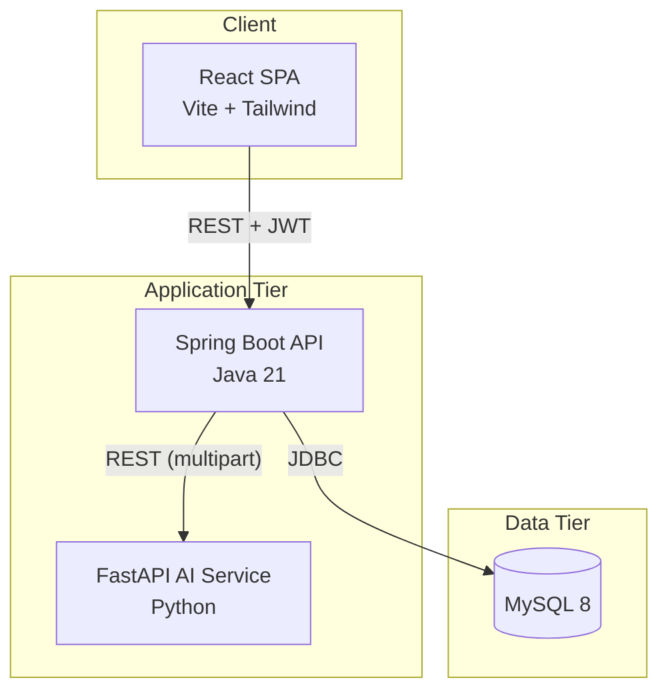
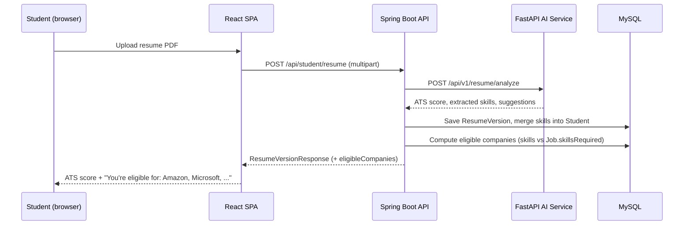

# PlaceNextAI — System Architecture

## 1. Overview

PlaceNextAI is a three-tier web application:

- **Frontend (React/Vite)** — a single-page app, role-scoped dashboards (Student, Recruiter, Admin,
  Alumni), talking to the backend exclusively over `/api/**` (proxied to the backend in dev, routed
  by nginx in production).
- **Backend (Spring Boot)** — the system of record. Stateless REST API secured with JWT, layered as
  `controller → service → repository → entity`, one feature module per concern (see §3).
- **AI service (FastAPI)** — a narrowly-scoped Python microservice that performs resume/ATS analysis
  (PDF parsing + scikit-learn based scoring) and returns structured JSON to the backend. The backend
  never talks to it on the critical path for anything except resume upload.
- **MySQL** — single relational store. Schema is Hibernate-managed (`ddl-auto=update` in dev,
  `validate` in prod) rather than hand-migrated; see §6 for the production caveat.

## 2. Request flow (example: resume upload → eligibility)

## 3. Backend module map

Layered by *type* within a flat package (`com.placenextai.{controller,service,service.impl,
repository,entity,dto,security,config,exception}`), not by feature folder — each feature's classes
are named consistently (e.g. `Interview*`, `Notification*`, `Eligibility*`) so they're easy to find
by search even without feature subpackages.

| Concern | Key classes |
|---|---|
| Auth & security | `SecurityConfig`, `JwtFilter`, `JwtUtil`, `CustomUserDetailsService`, `RateLimitFilter` |
| Students / Recruiters / Admin / Alumni | `StudentController/Service`, `RecruiterController`, `AdminController`, `AlumniController` |
| Resume analysis | `ResumeController/Service`, `ResumeAiClient` (→ AI service) |
| Skill gap & roadmap | `SkillGapService`, `RoadmapService` |
| Eligibility checker | `EligibilityService` — skills + CGPA match per job/company |
| Mock interview | `InterviewService`, `InterviewQuestionBank` (rule-based question generator + keyword scorer) |
| Jobs & applications | `JobService`, `ApplicationService` |
| Placement prediction | `PlacementPredictionService`, `ReadinessService` |
| Alumni mentorship | `MentorSlotService`, `MentorRequestService`, `MentorMessageService`, `MentorReviewService`, `MentorBookmarkService` |
| Gamification | `GamificationService` (XP/levels/streaks), `BadgeService`, `RecruiterBadgeService` |
| Admin analytics | `AdminAnalyticsService`, `ReportExportService` (PDF/Excel) |
| Notifications | `NotificationService`, `EmailService`, `MentorSessionReminderScheduler` |

## 4. Frontend module map

- `pages/` — one component per route, composed from `components/`
- `components/{ui,dashboard,badges,notifications,analytics,...}/` — shared building blocks
- `context/{AuthContext,ThemeContext,ToastContext}` — global state (auth session, day/night theme, toasts)
- `services/*.js` — one thin `axios` wrapper per backend feature, no business logic
- `hooks/{useSpeechSynthesis,useSpeechRecognition}` — Web Speech API wrappers for the voice interview

Routing is role-gated via `ProtectedRoute`, which redirects to the correct dashboard home
(`ROLE_HOME` map) if a user's role doesn't match the route.

## 5. Cross-cutting design decisions

- **Stateless auth** — JWT only, no server sessions, so the backend scales horizontally without sticky
  sessions.
- **Event-driven side effects** — most student actions funnel through `EventService.record(...)`,
  which fans out to readiness recomputation, gamification (XP/streaks), badge checks, and
  notifications from one call site, instead of scattering that logic across every feature.
- **AI service isolation** — resume analysis is the only synchronous dependency on the Python service;
  if it's down, only resume upload fails (checked via its own Docker healthcheck).
- **Mock interview is rule-based, not an LLM call** — a curated question bank keyed by skill plus a
  keyword/length scoring heuristic. This is a deliberate tradeoff: zero API keys/cost and fully
  deterministic, at the cost of not understanding free-form nuance the way a real model would. The
  `InterviewQuestionBank`/`InterviewServiceImpl` boundary is designed so a real LLM call could replace
  the scoring step later without touching the rest of the flow.
- **Email is opt-in** (`MAIL_ENABLED=false` by default) so a missing/invalid SMTP config never breaks
  a feature that happens to trigger a notification — failures are logged and swallowed.

## 6. Known production caveats (honest, not hidden)

- **Schema migrations**: Hibernate `ddl-auto` manages the schema; there's no Flyway/Liquibase yet.
  `application-prod.properties` sets `ddl-auto=validate` so production never silently auto-migrates,
  but that means schema changes must be applied manually before deploying new code that needs them.
- **Rate limiting is in-memory** (`RateLimitFilter`) — correct for a single backend instance; a
  horizontally-scaled deployment needs a shared store (e.g. Redis) instead.
- **Mock interview scoring is heuristic**, not semantic — see §5.
- **No refresh tokens** — JWTs are long-lived (`JWT_EXPIRATION_MS`, default 24h) with client-side
  auto-logout on expiry; there's no rotation/refresh flow.
